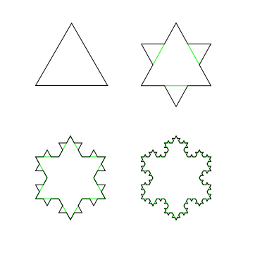
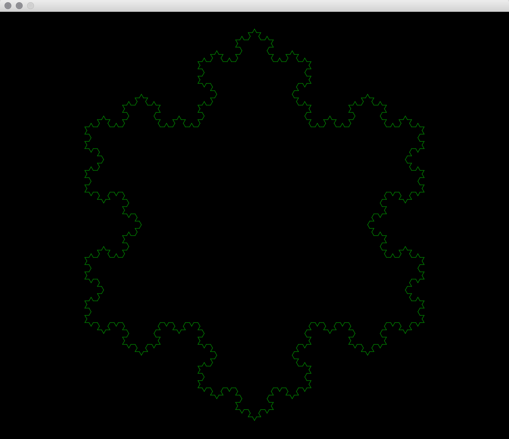
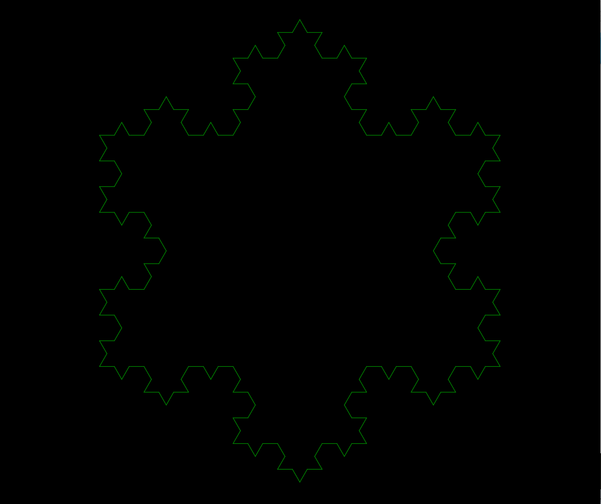

# Koch snowflake

The Koch snowflake (also known as the Koch curve, Koch star, or Koch island) is a mathematical curve and one of the earliest fractal curves to have been described. It is based on the Koch curve, which appeared in a 1904 paper titled "On a continuous curve without tangents, constructible from elementary geometry" (original French title: Sur une courbe continue sans tangente, obtenue par une construction géométrique élémentaire) by the Swedish mathematician Helge von Koch.

## Construction

The Koch snowflake can be constructed by starting with an equilateral triangle, then recursively altering each line segment as follows:

1. divide the line segment into three segments of equal length.
2. draw an equilateral triangle that has the middle segment from step 1 as its base and points outward.
3. remove the line segment that is the base of the triangle from step 2.

After one iteration of this process, the resulting shape is the outline of a hexagram.



### Run it

For this project you need *ant apache* to be able to run the build, download it easily with the following commands.

For Mac

```
➜ ~ ruby -e "$(curl -fsSL https://raw.githubusercontent.com/Homebrew/install/master/install)"
➜ ~ brew update
➜ ~ brew install ant

```
For Linux enter to [Installing Ant on Linux](http://dita-ot.sourceforge.net/doc/ot-userguide/xhtml/installing/linux_installingant.html) and follow the instructions.

Then we have to be in the project folder.

```
➜ ~ cd Documents/Fractal-Koch

```

Once there, type the following command. 

```
➜ ~ ant build
➜ ~ cd dist
```
We have to be in the dist folder to run the .jar
We need to unzip the .jar with the following command, where X represents the number of iteractions they want, from iteration 13, the program takes too much, so it is advisable to leave it until 13.
```
➜ ~ java -jar Fractal-Koch.jar X
```
## Results



