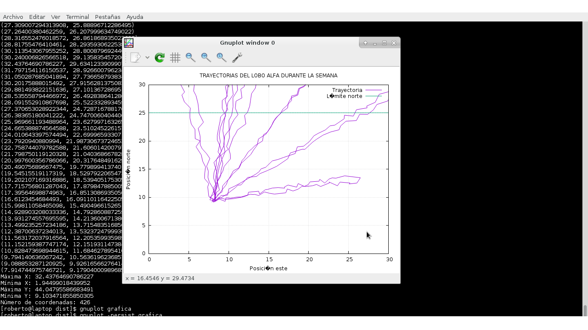

# Lobos
In a natural reserve, which is dedicated to caring for and preserving the Mexican wolves, suffered a great loss. The beta of the herd died and his body was inside a sawmill that is close to the reserve.

The readiness date of the trial and the owner of the sawmill defend that the wolf died inside the reserve not in the sawmill. It's necessary to know if those of the sawmill were the culprits or not, to determinate that, each wolf has inside its body a chip where we can find a record of the exact position and monitor him.

The most visited point is the den of the wolves, and we want to know if the beta died or not within the reserve.

For that we create we need a program in Java that given the input * telemetria.dat * so we can create a mapping of the coordinates of the wolf and thus find the culprit

## Implementation

First, we create the necessary programs to model the workspace. Use **GNUPlot** for the output and be able to map the data from *telemetry.dat*. The green line is the fronter of the natural reserve.

# Run it

```
➜ ~ javac -classpath bin/geom.jar Lobos.java
➜ ~ java -cp $CLASSPATH:bin/geom.jar Lobos 0 0 20 0 telemetria.dat > salida
```
in gnuplot
```
➜ ~ load 'grafica'
```
## Results 


