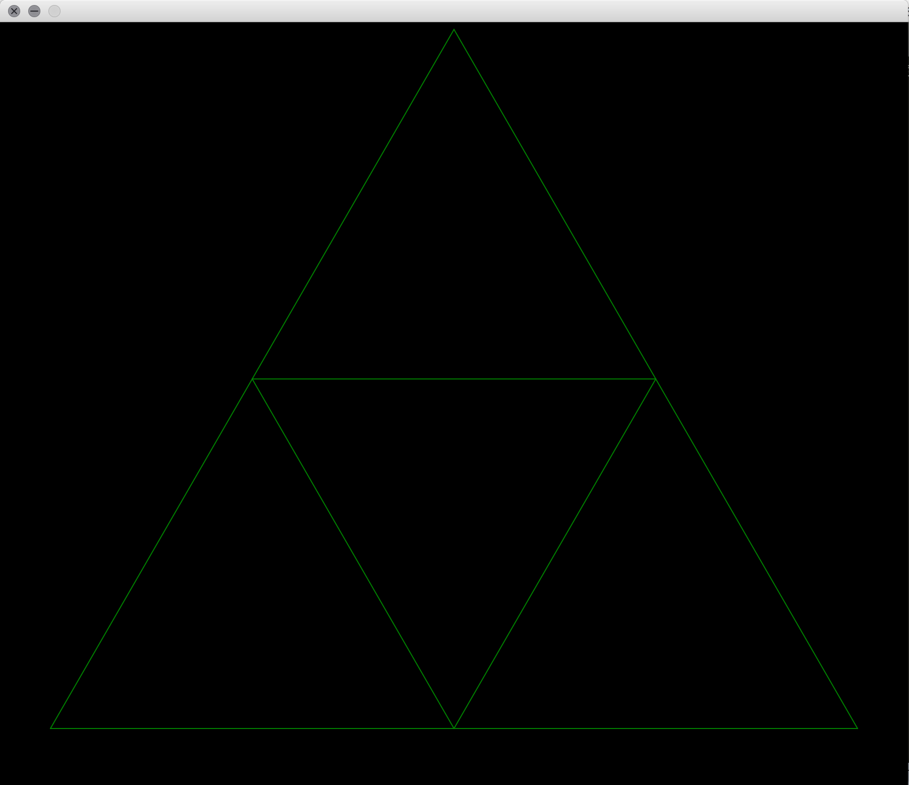
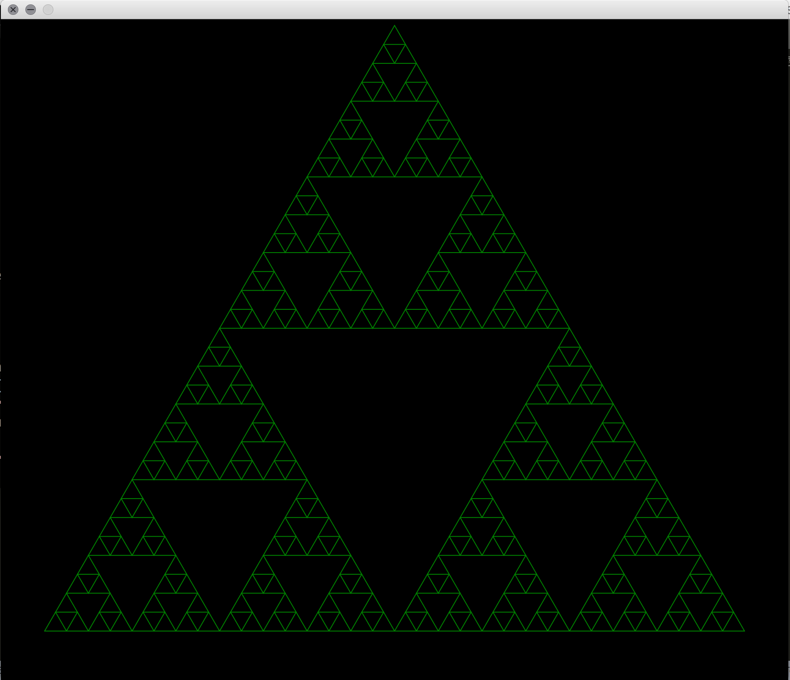

# Sierpinski triangle

The Sierpinski triangle, is a fractal and attractive fixed set with the overall shape of an equilateral triangle, subdivided recursively into smaller equilateral triangles. It's named after the Polish mathematician Wacław Sierpiński.

## Construction

The Sierpinski triangle may be constructed from an equilateral triangle by repeated removal of triangular subsets:

1. Start with an equilateral triangle.
2. Subdivide it into four smaller congruent equilateral triangles and remove the central triangle.
3. Repeat step 2 with each of the remaining smaller triangles.

This process of recursively removing triangles is an example of a finite subdivision rule.


### Run it

For this project you need *ant apache* to be able to run the build, download it easily with the following commands.

For Mac

```
➜ ~ ruby -e "$(curl -fsSL https://raw.githubusercontent.com/Homebrew/install/master/install)"
➜ ~ brew update
➜ ~ brew install ant

```
For Linux enter to [Installing Ant on Linux](http://dita-ot.sourceforge.net/doc/ot-userguide/xhtml/installing/linux_installingant.html) and follow the instructions.

Then we have to be in the project folder.

```
➜ ~ cd Documents/Sierpinski

```

Once there, type the following command. 

```
➜ ~ ant build
➜ ~ cd dist
```
We have to be in the dist folder to run the .jar
We need to unzip the .jar with the following command, where X represents the number of iteractions they want, from iteration 13, the program takes too much, so it is advisable to leave it until 13.
```
➜ ~ java -jar Sierpinski.jar X
```
## Results



